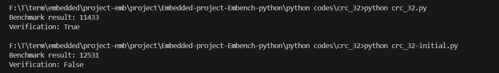

as you see there is a differnce when we run these 2 files
in the original C `crc_32-initial.c` code, we see these lines:

```c
srand_beebs(0);
r = crc32pseudo();
```

and inside `crc32pseudo()` it calls `rand_beebs()` instead of the standard `rand()`.

* **`rand_beebs()`** is a custom, deterministic pseudo-random number generator defined in Embench, not the standard C `rand()`.
* **`srand_beebs(seed)`** sets the seed for that generator (similar to `srand()` in standard C).

This is important because the benchmark expects the **same sequence of "random" numbers every run** to verify the result. Without using Embench’s deterministic PRNG, your Python port will never match the C verification number.

In this Python code (crc_32-initial.c) Python’s `random.randint` is used, which produces different sequences and therefore a different CRC.

**Solution:** We implemented `rand_beebs()` and `srand_beebs(seed)` in Python **to mimic the Embench version**. A typical Embench deterministic PRNG works like this in C (the result is in crc_32.py):

```c
static unsigned int next = 1;
void srand_beebs(unsigned int seed) { next = seed; }
int rand_beebs(void) { next = next * 1103515245 + 12345; return (next >> 16) & 0xFF; }
```

In Python, you can replicate it like this:

```python
next_beebs = 1

def srand_beebs(seed):
    global next_beebs
    next_beebs = seed

def rand_beebs():
    global next_beebs
    next_beebs = (next_beebs * 1103515245 + 12345) & 0xFFFFFFFF
    return (next_beebs >> 16) & 0xFF
```

Once we replace `random.randint` with this `rand_beebs()` and call `srand_beebs(0)` at the start of the benchmark, your Python version will **produce the correct result (11433)** as shown in the image.


