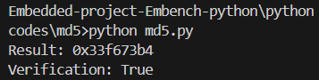

# code explanation for md5 

1. **Constants & Heap**

   * `LOCAL_SCALE_FACTOR`, `HEAP_SIZE`, `MSG_SIZE`, `RESULT` match the C macros.
   * A fake `heap` is created (C’s static buffer is simulated with `bytearray`).

2. **LEFTROTATE**

   * Direct port of the C macro `#define LEFTROTATE(x, c)`.

3. **Global Hash State**

   * `h0, h1, h2, h3` keep the running state of the MD5 digest.

4. **`md5()` Function**

   * Implements the MD5 algorithm:

     * Defines **shift amounts** `r` and **sine constants** `k`.
     * Initializes hash values `h0, h1, h2, h3`.
     * **Preprocessing:** pads message with `0x80` and appends original length.
     * Splits input into **512-bit chunks** (`w`).
     * Runs **64 rounds** of MD5 mixing with different logical functions.
     * Updates hash state after processing all chunks.

5. **`benchmark_body()`**

   * Allocates a message of size `len`.
   * Initializes it with values `0,1,2,...`.
   * Calls `md5(msg, len)`.
   * Returns XOR of hash state values (same as C).

6. **`warm_caches()` and `benchmark()`**

   * Helpers for the benchmark harness (simulate repeated runs).

7. **`verify_benchmark()`**

   * Compares result with `RESULT` constant.

## output

