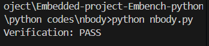

## Nbody Benchmark – Detailed Explanation

### Purpose

The **nbody** benchmark simulates the gravitational interactions between a small set of celestial bodies. It is a **floating-point intensive workload** used to evaluate how well a processor handles numerical computations, loops, and array accesses.

Unlike a full astrophysical simulation, this benchmark is designed to be compact and repeatable while still stressing the CPU.

---

### Inputs

The program does **not** take inputs from the user. Instead, it starts with **predefined initial conditions** for the solar system:

* **Bodies included:**

  * Sun
  * Jupiter
  * Saturn
  * Uranus
  * Neptune

* Each body is initialized with:

  * **Position (`x`)** → its 3D coordinates in space
  * **Velocity (`v`)** → its motion in 3D space
  * **Mass (`mass`)** → proportional to its real astronomical mass

These values are stored in the `solar_bodies[]` array at the start of the program.

---

### What the Code Does

1. **Momentum Adjustment (`offset_momentum`)**

   * Ensures that the **total system momentum is zero**.
   * This is done by adjusting the Sun’s velocity to balance the momentum of all planets.
   * This makes the simulation stable and prevents drift.

2. **Energy Calculation (`bodies_energy`)**

   * Computes the **total energy of the system**:

     * **Kinetic energy** from each body’s velocity.
     * **Potential energy** from gravitational attraction between pairs of bodies.
   * This requires computing distances between every pair of planets.

3. **Benchmark Loop (`benchmark_body`)**

   * Runs the momentum adjustment once.
   * Then repeatedly calculates the total energy of the system (100 times per iteration).
   * The sum of all energy calculations is stored as `tot_e`.

4. **Verification (`verify_benchmark`)**

   * The final computed total energy (`tot_e`) is compared against a **known correct reference value**.
   * If the energy matches within a small tolerance, the benchmark prints:

     ```
     Verification: PASS
     ```
   * Otherwise, it would print **FAIL**.
   * This ensures the code ran correctly and produced valid physics results.

---

### Outputs

* **Console Output:**



  * The benchmark ran successfully.
  * The calculated total system energy matched the expected correct value.
 


---


