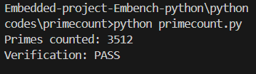

## Primecount Benchmark (Python)

**Overview**
The `primecount` benchmark measures CPU performance by counting prime numbers using a compact sieve-based algorithm. It is a computational workload that stresses integer arithmetic, branching, and array memory access — making it suitable for evaluating embedded system performance.

**Key Details**

* Algorithm: Incremental sieve (tracks multiples of known primes).
* Parameters:

  * `SZ = 42` → maximum size of arrays for storing primes and sieve data.
  * `NPRIMES = 3512` → expected total count of primes discovered.
* Verification: The result is compared against `NPRIMES` to confirm correctness.

**How to Run**

```bash
python primecount.py
```

**Sample Output**

```
Primes counted: 3512
Verification: PASS
```



**Interpretation**

* If verification passes, the benchmark has produced the correct number of primes.
* The program can be repeated multiple times (via `benchmark_body`) to generate consistent workload for timing and profiling.

---

